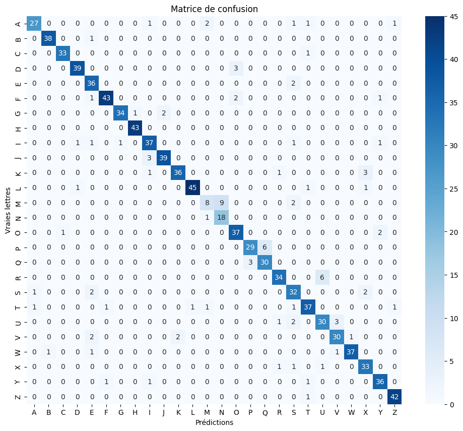

# deep-learning-project-examination-Sign-Language-ASL

Deep learning project completed in **2025** for the **Deep Learning** module of the M1 SI2A program.

## Overview

This project compares two pipelines for static ASL alphabet recognition:

- **Keypoint + MLP pipeline**: 21 MediaPipe hand landmarks transformed into a 42D feature vector.
- **Image + CNN pipeline**: direct classification of 64x64 RGB crops.

The repository includes:

- the original notebook used during the 2025 project phase,
- a cleaner V2 codebase with CLI scripts, saved artifacts, richer metrics, and stabilized video inference.

## Visual Placeholders

Add your screenshots later in `docs/screenshots/`.

![Confusion Matrix CNN]
![Confusion Matrix MLP]
![Inference Video Example]docs/test_videos/video2.mp4

## Reference Results (Report)

- **MLP on keypoints**: **88.7%** accuracy
- **CNN on RGB images**: **93.6%** accuracy

## Quantitative Comparison (Report)

### 1. Static Classification

- Absolute gain (CNN vs MLP): about **+4.9 accuracy points**
- Model size (order of magnitude):
  - MLP: around **30k** parameters
  - CNN: around **1.6M** parameters

### 2. Video Inference (Report Tests)

- Mean FPS (GTX T4):
  - MLP + landmarks: **90 FPS**
  - CNN + RGB: **42 FPS**
- Mean token-level Levenshtein error:
  - MLP + landmarks: **15.3**
  - CNN + RGB: **7.8**

Quick interpretation:

- **MLP** is faster and lighter.
- **CNN** is more accurate for real-world sequence recognition.
- Temporal smoothing (windowed majority strategy) reduces transient video misfires.

## Error Analysis (Report)

- Recurrent confusions on visually similar letters: `C/Q`, `F/P`, `M/N`, `U/V/W`.
- Landmark pipeline (MLP): sensitive to thumb occlusions and hand-out-of-frame cases.
- RGB pipeline (CNN): sensitive to blur and extreme scale changes, but stronger under partial finger overlap thanks to texture/color cues.

## Implemented V2 Improvements

- clear separation of preprocessing, training, evaluation, and inference;
- more robust landmark extraction:
  - rotation and palm-scale normalization,
  - quality filtering,
  - unstable-frame rejection;
- CNN data augmentation;
- optional lightweight pretrained backbone (**MobileNetV2**);
- extended evaluation:
  - accuracy,
  - macro F1,
  - macro recall,
  - per-class report,
  - saved confusion matrix;
- systematic artifact saving (`.keras`, `classes.npy`, `metrics.json`);
- stabilized video inference (windowing + EMA + confidence threshold + deduplication).

## Tech Stack

- Python
- TensorFlow / Keras
- MediaPipe
- OpenCV
- scikit-learn
- NumPy / pandas
- matplotlib / seaborn
- gTTS

## Repository Structure

- `Sign_Language_.ipynb`: original notebook (initial project phase)
- `DL_Report.pdf`: full final report
- `requirements.txt`: Python dependencies
- `src/asl_v2/config.py`: training configurations
- `src/asl_v2/data.py`: image/keypoint loading and CSV export
- `src/asl_v2/landmarks.py`: robust MediaPipe extraction
- `src/asl_v2/models.py`: MLP/CNN architectures (including pretrained option)
- `src/asl_v2/evaluation.py`: metrics and confusion matrix utilities
- `src/asl_v2/temporal.py`: temporal stabilization for video outputs
- `scripts/train_mlp.py`: MLP train/eval pipeline
- `scripts/train_cnn.py`: CNN train/eval pipeline
- `scripts/infer_video.py`: stabilized video inference

## Installation

```bash
python -m venv .venv
.venv\Scripts\activate
pip install -r requirements.txt
```

## Usage

### 1. Train MLP (landmarks)

```bash
python scripts/train_mlp.py --dataset-root "C:\path\to\asl_alphabet_train"
```

Useful options:

- `--max-per-class 300`
- `--epochs 30`
- `--artifacts-dir artifacts/mlp`

### 2. Train CNN (images)

```bash
python scripts/train_cnn.py --dataset-root "C:\path\to\asl_alphabet_train"
```

Useful options:

- `--use-pretrained` (enable MobileNetV2)
- `--trainable-backbone`
- `--max-per-class 500`

### 3. Run Stabilized Video Inference

CNN mode:

```bash
python scripts/infer_video.py --mode cnn --video "C:\path\to\video.mp4" --model artifacts/cnn/cnn_model.keras --classes artifacts/cnn/classes.npy
```

MLP landmarks mode:

```bash
python scripts/infer_video.py --mode mlp_landmarks --video "C:\path\to\video.mp4" --model artifacts/mlp/mlp_model.keras --classes artifacts/mlp/classes.npy
```

## Skills Demonstrated

- computer vision preprocessing for gesture recognition;
- keypoint extraction and normalization;
- TensorFlow/Keras model training and comparison;
- multiclass evaluation and error analysis;
- end-to-end inference pipeline design for practical use.

